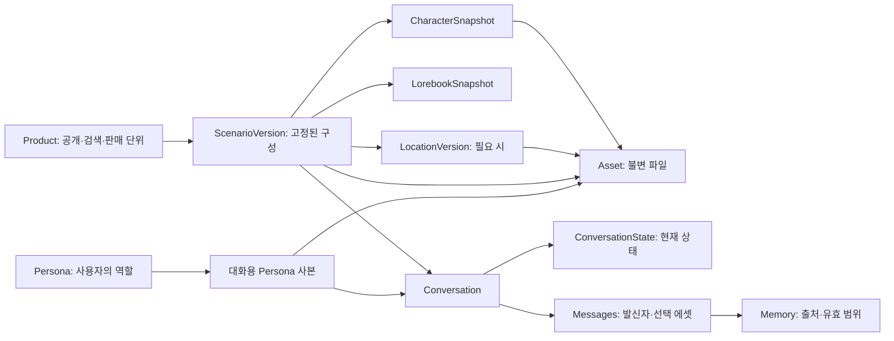

# AI 캐릭터 채팅 — 현재 코드 분석과 구조 제안

작성일: 2026-09-07, Asia/Seoul  
근거 자료: [조사 보고서·출처 목록·접근 제한](C:/Users/smj/Desktop/CHAT_STARTER_KIT/chat_kit/docs/research/2026-09-07-character-chat-sources.md)  
분석 기준: HEAD `2e9222a39df04d71f6ff6a46c21b67e7c2e89698`와 조사 당시 미커밋 변경을 포함한 작업 폴더. HEAD만을 분석한 것이 아니다.  
범위: 제안 문서 작성. 앱 코드·DB 스키마·기존 설계 문서는 수정하지 않음.

## 1. 권장 방향

**PostgreSQL과 현재 모듈형 모놀리스를 유지하면서, 공통 에셋·유저 페르소나·대화 실행 구성을 먼저 보강하는 방향을 권장한다.** 캐릭터·로어북·메모리의 기존 분리는 활용할 수 있다. 장소별·시나리오별 파일이 필요하다는 이유만으로 모든 도메인을 새로 만들 필요는 없다.

현재 가장 큰 공백은 에셋 종류의 개수보다 **정의를 대화에 고정하고, 필요한 정보를 선택해 모델에 보내며, 선택된 에셋을 화면에 표시하는 실행 흐름**이다. 채팅·상품·대화 서비스가 아직 비어 있어 이 경계를 잡기 좋은 시점이다.

우선 결정할 설계는 다음과 같다.

1. 캐릭터의 `persona_prompt`는 AI 등장인물 설정으로 유지하고, 유저가 연기할 역할은 별도 `persona` 모듈로 관리한다.
2. 파일 저장을 캐릭터에서 분리하고, 캐릭터·상품·유저 페르소나·장소 로어에 연결할 수 있게 한다.
3. 기존 publication snapshot을 활용해 대화가 특정 버전을 사용하게 한다. 사용자 페르소나와 대화별 추가 설정도 함께 고정한다.
4. 로어 활성화, 토큰 예산, 프롬프트 배치를 분리하고 최종 포함/제외 이유를 추적한다.
5. 장소는 당분간 `LorebookEntry.entry_type=location`으로 표현한다. 상품은 최소안에서 시나리오 역할을 계속 맡는다.

이 문서의 권장안은 **공식 자료와 로컬 코드에 근거한 설계 제안**이다. 아카라이브 공지·개념글은 접근 차단으로 읽지 못했으며, 커뮤니티 수요를 검증했다고 전제하지 않는다.

## 2. 현재 구현과 차이

‘모델 있음’, ‘서비스 있음’, ‘앱에 통합됨’을 구분했다. 파일이 존재해도 내용이 비어 있으면 구현된 기능으로 세지 않았다.

| 영역 | 코드에서 확인한 상태 | 필요한 보완 | 근거 |
| --- | --- | --- | --- |
| 캐릭터 | 이름·소개·`persona_prompt`·기본 모델, CRUD·조회·HTTP 라우터 있음 | 성격/시나리오/예시/제작자 메모를 가져올 때의 매핑 정책 | [모델](C:/Users/smj/Desktop/CHAT_STARTER_KIT/chat_kit/apps/api/app/db/models/character.py:38), [command](C:/Users/smj/Desktop/CHAT_STARTER_KIT/chat_kit/apps/api/app/modules/content/character/service/command.py:45) |
| 감정 이미지·에셋 | 캐릭터에 종속된 테이블과 조회 함수 있음. 이미지/에셋 추가 서비스는 `NotImplementedError` | 공통 저장소·연결·업로드·표시 흐름 | [미디어 모델](C:/Users/smj/Desktop/CHAT_STARTER_KIT/chat_kit/apps/api/app/db/models/character.py:76), [추가 서비스](C:/Users/smj/Desktop/CHAT_STARTER_KIT/chat_kit/apps/api/app/modules/content/character/service/command.py:100) |
| 유저 페르소나 | 계정 `display_name`은 있으나 유저 역할 프로필·대화 연결은 없음 | 별도 역할 프로필과 대화별 선택값 | [identity 모델](C:/Users/smj/Desktop/CHAT_STARTER_KIT/chat_kit/apps/api/app/db/models/identity.py:23) |
| 로어 정의 | 장소·사건·규칙 등 타입, 활성화 방식·키워드·우선순위·배치·개별 예산·벡터 컬럼 있음 | 묶음 전체 예산·검색 깊이·적용 범위 | [로어 모델](C:/Users/smj/Desktop/CHAT_STARTER_KIT/chat_kit/apps/api/app/db/models/lorebook.py:93) |
| 로어 실행 | 상시 항목 조회, exact/contains/regex 키워드 매칭 구현 | 최종 예산 적용·스냅샷 입력·semantic/manual 실행 정책 | [활성화 코드](C:/Users/smj/Desktop/CHAT_STARTER_KIT/chat_kit/apps/api/app/modules/content/lorebook/service/query.py:150) |
| 로어 적용 대상 | 상품↔로어북 관계 있음 | 캐릭터/페르소나/대화별 연결 또는 대화 구성에 이를 반영하는 resolver | [ProductLorebook](C:/Users/smj/Desktop/CHAT_STARTER_KIT/chat_kit/apps/api/app/db/models/product.py:106) |
| 상품·시나리오 | 상품 제목·소개·첫 메시지, 캐릭터/로어 N:M 모델 있음. 서비스·repository·schemas·router는 빈 파일 | 실행용 상황 설명, 시작 상태, 구성 조회·발행 흐름 | [상품 모델](C:/Users/smj/Desktop/CHAT_STARTER_KIT/chat_kit/apps/api/app/db/models/product.py:40), [빈 서비스](C:/Users/smj/Desktop/CHAT_STARTER_KIT/chat_kit/apps/api/app/modules/content/product/service.py) |
| 대화 | `product_id` 필수, 캐릭터 연결·모델 선택 컬럼 있음. 실행 서비스는 빈 파일 | 버전 고정·페르소나·대화별 상태와 설정 | [Conversation](C:/Users/smj/Desktop/CHAT_STARTER_KIT/chat_kit/apps/api/app/db/models/chat.py:30), [빈 서비스](C:/Users/smj/Desktop/CHAT_STARTER_KIT/chat_kit/apps/api/app/modules/chatting/conversation/service.py) |
| 스냅샷 | 상품·캐릭터·로어 스냅샷과 연결 모델, SQL 있음 | 발행 트랜잭션·검증·대화 고정·파일 보존 | [스냅샷 설명](C:/Users/smj/Desktop/CHAT_STARTER_KIT/chat_kit/apps/api/app/db/models/snapshot/README.md:3) |
| 메모리 | summary/fact/event, 소유권과 대화 범위 조회, 최신 요약·벡터 검색 인터페이스 있음 | 자동 추출·요약 갱신·수동 고정·출처와 무효화·임베딩 공급자 | [모델](C:/Users/smj/Desktop/CHAT_STARTER_KIT/chat_kit/apps/api/app/db/models/memory.py:19), [query](C:/Users/smj/Desktop/CHAT_STARTER_KIT/chat_kit/apps/api/app/modules/chatting/memory/service/query.py:70) |
| 프롬프트·채팅 | chat 서비스·stream·repository·schemas·types가 빈 파일 | 전체 조립·생성·저장 실행 경로 | [chat 서비스](C:/Users/smj/Desktop/CHAT_STARTER_KIT/chat_kit/apps/api/app/modules/chatting/chat/service.py) |
| LLM | 공급자 선택·결과/사용량/오류 정규화 있음. 입력은 문자열 `request_json` | 역할과 콘텐츠 블록을 보존하는 입력 계약 | [서비스](C:/Users/smj/Desktop/CHAT_STARTER_KIT/chat_kit/apps/api/app/modules/llm/service.py:56) |
| 앱 통합 | character/lorebook 인증·DB 의존성은 기본적으로 503. `apps/web`와 alembic에 파일 없음 | 앱 엔트리·인증·세션·마이그레이션·화면 연결 | [character 의존성](C:/Users/smj/Desktop/CHAT_STARTER_KIT/chat_kit/apps/api/app/modules/content/character/dependencies.py:14), [lorebook 의존성](C:/Users/smj/Desktop/CHAT_STARTER_KIT/chat_kit/apps/api/app/modules/content/lorebook/dependencies.py:13) |

### 구조를 확정하기 전에 정리할 불일치

**기억 출처 컬럼:** 초기 SQL에는 `conversation_memories.source_message_id`가 있지만 현재 ORM 모델에는 없다. ‘출처가 완전히 구현되어 있다’고 볼 수 없으며, 단일 메시지 참조를 유지할지 다중 출처로 확장할지 정한 뒤 SQL·ORM·DTO를 맞춰야 한다. [초기 SQL](C:/Users/smj/Desktop/CHAT_STARTER_KIT/chat_kit/infra/postgres/init/002_schema.sql:236)

**메시지 발신자 삭제:** `Message.character_id`는 캐릭터 삭제 때 NULL로 바뀌도록 선언돼 있으나, character 발신 메시지는 캐릭터 ID가 반드시 있어야 한다는 CHECK도 있다. 해당 메시지가 존재하면 삭제 동작이 제약과 충돌할 수 있다. 대화 참가자 또는 캐릭터 스냅샷에 메시지를 연결하고 원본 ID는 출처용으로 분리하는 안을 권장한다. [Message 제약](C:/Users/smj/Desktop/CHAT_STARTER_KIT/chat_kit/apps/api/app/db/models/chat.py:91)

**설계 메모와 현재 대화 모델:** 9월 2일 메모는 상품 없는 대화를 위해 `product_id` nullable을 제안하지만 현재 모델·SQL은 필수다. 최소안은 상품 기반 시작을 유지한다. 직접 캐릭터 채팅을 제품 범위에 넣는 시점에 nullable 또는 비공개 실행 패키지 생성 중 하나를 결정한다. [기존 메모](C:/Users/smj/Desktop/CHAT_STARTER_KIT/chat_kit/references_document/character_chat_architecture_notes.md), [현재 필드](C:/Users/smj/Desktop/CHAT_STARTER_KIT/chat_kit/apps/api/app/db/models/chat.py:42)

**문서의 구현 상태:** 루트 README는 환경만 남았다고 설명하지만 실제로 도메인 코드가 있다. 메모리 고려사항도 후속 구현 업데이트와 이전 보류 기록이 함께 있다. 이번 분석에서는 최신 코드와 문서 상단의 업데이트를 우선했다. [README](C:/Users/smj/Desktop/CHAT_STARTER_KIT/chat_kit/README.md), [메모리 기록](C:/Users/smj/Desktop/CHAT_STARTER_KIT/chat_kit/references_document/memory_고려사항.md:5)

## 3. 필수와 선택 기능

여기서 필수는 **이 프로젝트의 목표인 재사용 가능한 캐릭터 채팅 서비스**를 기준으로 정한 우선순위다. 모든 AI 채팅 제품에 보편적으로 필요한 항목이라는 뜻은 아니다.

| 우선순위 | 기능 | 이유·완료 기준 |
| --- | --- | --- |
| P0 | 상품 구성→대화 생성→모델 호출→메시지 저장 | 현재 비어 있는 기본 실행 경로. mock으로 왕복이 가능해야 함 |
| P0 | 인증·권한·DB 세션 통합 | 사용자별 캐릭터/페르소나/기억 범위를 보장하고 실제 API가 동작해야 함 |
| P0 | 유저 페르소나 텍스트와 대화별 고정 | 계정, 유저 역할, AI 캐릭터의 혼동 방지 |
| P0 | 스냅샷을 통한 대화 설정 고정 | 작가 수정·원본 삭제 후에도 대화의 설정과 발신자 유지 |
| P0 | 상시·키워드 로어와 전체 토큰 예산 | 후보가 많아도 모델 한도를 지키며 이유를 확인할 수 있어야 함 |
| P0 | 공통 에셋 식별·참조 구조 | 캐릭터·유저 아바타·상품 배경을 같은 저장 체계로 처리. 초기 이미지 업로드/표시 범위 포함 |
| P0 | 구조화된 LLM 입력과 조립 미리보기 | 실제 역할·순서·포함 항목·토큰량이 확인 가능해야 함 |
| P1 | 수동 기억 노트·요약 갱신·정정 | 긴 대화 지원을 목표로 할 때 필요. 짧은 대화 MVP의 선행 조건은 아님 |
| P1 | 에셋 호출·감정 이미지·배경 선택 | 파일 보관을 넘어 상황별 연출이 필요할 때. 초기에는 수동 선택과 기본값으로 시작 가능 |
| P1 | 캐릭터/페르소나/대화별 추가 로어 | 사용자별 커스터마이징이 실제로 필요할 때 |
| P1 | 카드·로어북 JSON 가져오기와 손실 보고 | 커뮤니티 자료 활용을 제품 기능으로 제공할 때 필요 |
| P2 | CHARX/PNG 패키지, 오디오·영상·Live2D | 표현력·공유 기능의 확장. 파일 규약 지원과 실행 지원을 구분 |
| P2 | 장소 테이블·지도·이동 규칙·분기 시나리오 | 상태를 프로그램이 제어하는 게임형 진행 요구가 생길 때 |
| P2 | semantic 로어, 재귀·확률·타이머·복합 조건 | 동작 평가와 명확한 사용 사례 확보 후 도입 |
| P2 | 그룹 발화 스케줄·대화 분기·재생성 이력 | 다인 대화와 분기 탐색 요구에 맞춰 확장 |
| P2 | 스크립트·HTML UI·외부 모듈 실행 | 일반 텍스트 카드와 실행 가능한 코드는 다른 기능 범위로 설계 |

## 4. 최소 수정안 A — 현재 도메인을 유지

목표: 한 상품의 캐릭터·로어·시작 상황을 선택한 유저 페르소나로 실행하고, 캐릭터/유저 이미지와 상품/장소 배경을 참조할 수 있게 한다. 장소와 시나리오의 독립 편집기는 나중에 도입한다.

### A1. 공통 에셋과 연결

제안 모델:

```text
assets
  id, owner_id, storage_key, mime_type, media_kind
  byte_size, checksum, status, created_at

asset_bindings
  id, asset_id
  character_id?, product_id?, persona_id?, lorebook_entry_id?
  purpose, asset_key, is_default, sort_order
```

- `assets`는 파일 메타데이터와 저장소의 불변 키를 관리한다. `media_kind`는 image/audio/video 등이며 실제 허용 범위는 초기 이미지로 제한할 수 있다.
- `asset_bindings`는 쓰임새를 관리한다. 예: 캐릭터의 `expression/happy`, 상품의 `background/default`, 페르소나의 `avatar/default`, 장소 로어의 `background/rainy`.
- 네 대상 FK 중 **정확히 하나만** 존재하도록 CHECK를 둔다. 대상별 `asset_key` 유일성, 목적별 기본값 유일성을 부분 인덱스로 보장한다. 대상 없는 `owner_type/owner_id` 문자열 연결보다 초기 정합성을 명확히 할 수 있다.
- `owner_id`는 파일 관리 주체이며 연결 대상과 다르다. 다른 제작자의 공개 자산을 연결할 수 있는지와 발행 후 이용 범위는 별도 정책으로 검증한다.
- 현재 `character_images`와 `character_assets`는 이관이 끝날 때까지 호환 조회로 유지한다. 같은 파일 URL의 반복 행을 처리하되, URL이 같다고 파일 내용이 같다고 단정하지 않는다.
- 스냅샷에는 불변 `asset_id`와 바인딩의 키·목적·기본값을 기록한다. 일시적인 서명 URL은 저장하지 않고 응답 시 만든다. 파일을 교체하면 새 자산 버전을 만든다.
- 원본 삭제와 파일 삭제를 분리한다. 스냅샷·메시지가 쓰는 파일은 보존하고, 미참조 파일만 정리한다.

이 설계에서는 ‘장소 에셋’을 표현하기 위해 `locations` 테이블이 반드시 필요하지 않다. 장소 로어 엔트리에 배경을 연결하면 된다. 조건부 자동 선택은 A5와 분리한다.

### A2. 유저 페르소나

```text
personas
  id, owner_id, name, description, created_at, updated_at

conversation_contexts
  conversation_id (PK/FK), schema_version
  persona_source_id?, persona_snapshot JSONB
  extra_lorebook_snapshot_ids 또는 별도 연결 테이블
  initial_state JSONB
```

`persona_snapshot`은 검증된 이름·설명·아바타 자산 참조를 담는 대화용 고정 데이터다. 공개 상품 스냅샷과 사용자의 비공개 프로필을 혼합하지 않는다. 원본 페르소나 삭제 후에도 기존 대화의 사본은 남긴다.

최소 UI는 ‘기본 페르소나 1개 자동 생성→대화 시작 시 선택’으로 충분하다. 기본값은 계정 프로필에서 최초 복사하되, 이후 계정 이름 변경이 과거 대화를 바꾸지 않게 한다. 최소안에서는 대화 중 역할 전환을 제한하고, 확장할 때 메시지마다 참가자/페르소나 버전을 기록한다.

### A3. 상품을 시나리오 실행 정의로 보강

상품의 소개 `description`과 모델에 보내는 상황 설명을 구분해 `scenario_prompt`를 추가한다. 초기 상태와 시작 배경 키는 검증된 `runtime_config`에 둘 수 있다. 스키마 버전과 허용 키를 정하며 아무 JSON이나 실행 설정으로 사용하지 않는다.

`opening_message`는 현재 필드를 사용한다. 한 상품에 복수 시작 상황이 필요한 시점에 `product_openings`로 분리한다. 첫 메시지가 화자인지 내레이터인지도 기록해야 하므로, 최소안에서는 주인공 1명의 인사로 한정하거나 내레이터 참가자를 명시한다.

캐릭터의 기존 `description`은 현재 소개/홍보 조회에도 사용된다. 외부 카드의 AI용 `description`을 그대로 이 컬럼에 덮어 넣으면 공개 소개와 비공개 프롬프트가 혼합될 수 있다. 가져오기 매핑은 7절의 별도 계약으로 둔다.

### A4. 기존 스냅샷을 대화에 연결

- `conversations.product_snapshot_id`를 도입하고, 발행된 상품 버전을 참조하게 한다.
- `product_id`는 최소안에서 현행 필수 정책을 유지하되, 실행 데이터는 스냅샷에서 읽는다. 원본 삭제는 초기에는 비활성화/소프트 삭제로 처리하는 편이 기존 RESTRICT와 맞는다.
- `conversation_characters`에 `character_snapshot_id`를 연결하거나, `conversation_participants`로 확장한다. 원본 캐릭터 ID는 provenance 용도다.
- character 발신 메시지는 대화 참가자를 참조하도록 전환한다. 이때 기존 `character_id` CHECK와 삭제 정책도 같이 변경한다. 컬럼만 추가해서는 문제가 해결되지 않는다.
- 발행은 상품과 모든 구성 연결을 한 트랜잭션으로 저장한다. 관련 원본을 일정한 순서로 잠그거나 검증한 리비전을 사용해 혼합 버전 발행을 막는다.
- 스냅샷의 현재 JSON 검사는 object 여부뿐이다. 캐릭터/로어/상품별 payload DTO 검증, 스키마 버전별 reader와 불변성 정책을 추가한다.

스냅샷 모델을 새로 만들 필요는 없다. 기존 구조에 실행 계약과 참조를 연결하면 된다. 단, 현재 `get_always_entries`와 `activate_keyword_entries`는 수정 가능한 원본 테이블을 조회하므로 그대로 쓰면 버전 고정이 깨진다. **검증된 엔트리 목록을 입력받는 순수 활성화 함수**를 추출하고, 원본 편집 미리보기와 스냅샷 실행 양쪽에서 재사용할 것을 제안한다.

### A5. 로어·프롬프트·표시 처리

최소 설정은 `scan_depth_messages`, `lore_budget_tokens`, 고정된 placement 순서로 시작한다. 단위를 ‘메시지 수’로 명시해 턴 수와 혼동하지 않는다.

현재 `priority DESC` 조회 순서를 최종 프롬프트 순서로 그대로 쓰지 않는다. **예산에서 살릴 순위**와 **문장 삽입 순서**를 별도로 정한다. CCv2도 이 두 필드를 구분한다. [CCv2 명세](https://github.com/malfoyslastname/character-card-spec-v2/blob/main/spec_v2.md)

초기 정책 제안:

- `priority`는 후보 채택 우선순위로 유지하고 `insertion_order`를 분리한다.
- 전체 로어 예산과 엔트리별 예산을 별도로 적용한다. 현재 `token_budget`은 검증/전달만 되며 실행 의미가 확정되어 있지 않다.
- 엔트리 예산 `NULL`은 개별 제한 없음, `0`은 주입 안 함으로 정의하고 UI와 맞춘다. 긴 설정을 임의로 잘라 뜻을 바꾸기보다 해당 엔트리를 제외하고 사유를 기록한다.
- 필수 규칙과 현재 유저 메시지가 한도를 넘으면 조용히 유실시키지 않고 구성 오류를 반환한다. 오래된 기록·선택 로어 등 축소 가능한 부분의 순서를 명시한다.
- `semantic/manual`은 enum에 있다는 이유로 동작한다고 표시하지 않는다. 실행기가 지원하는 활성화 방식만 선택할 수 있게 하고, 외부 데이터의 미지원 설정은 경고한다.
- 첫 연출 버전은 수동/기본 에셋 선택으로 충분하다. 자동 선택은 허용된 자산 키를 출력→검증→저장→표시하는 경로로 추가한다. 외부 URL을 모델이 만들어도 그대로 파일 참조로 채택하지 않는다.

## 5. 확장 개편안 B — 시나리오와 실행 상태를 독립

여러 상품이 같은 세계관/시나리오를 공유하거나, 장소 이동·상태·복수 시작 상황·분기가 필요할 때 선택한다. **모듈을 분리하되 서버는 하나로 유지한다.**



### 권장 모듈 경계

| 모듈 | 책임 | 확장 시 주요 데이터 |
| --- | --- | --- |
| identity | 로그인·계정·권한 | 기존 user |
| character | AI 등장인물 정의 | personality, examples, creator metadata |
| persona | 사용자가 연기하는 역할 | persona, 대화용 사본/버전 |
| lorebook | 재사용 설정과 활성화 | 적용 연결, 조건, 엔트리, 명세 확장값 |
| asset | 파일 저장·참조·보존 | assets, 도메인별 binding |
| scenario | 시작 조건·참가자·로어·연출 구성 | scenarios, openings, scenario_versions |
| world/location | 재사용 공간과 연결·이동 규칙 | 요구가 생길 때만 locations, transitions |
| product | 공개·탐색·판매 설정 | scenario_version 참조, 가격/공개 상태 |
| conversation | 세션·참가자·상태·선택 버전 | participants, state_revision |
| prompt | 선택된 재료를 역할·순서·예산에 맞게 조립 | PromptPlan, PromptTrace |
| chat | 한 턴의 생성 실행과 저장 조율 | generation_runs, messages, asset events |
| memory | 요약·사실·사건·정정·검색 | source links, revisions, status |
| import_export | 카드/로어/패키지 변환 | format/version, 원문, 변환 경고 |
| llm | 공급자별 요청 변환·호출·사용량 | 공통 입력/결과·모델 능력 정보 |

기존 상품 스냅샷은 공개 버전의 외곽 역할을 유지하고 고정된 `scenario_version`을 참조하도록 전환할 수 있다. 시나리오 분리 전 스냅샷은 구버전 reader로 계속 읽는다. 새 reader가 과거 대화의 데이터를 최신 원본으로 재해석하지 않게 한다.

에셋 대상이 더 늘면 최소안의 단일 binding 테이블을 도메인별 연결 테이블로 나눌 수 있다. 서비스에는 `resolve_assets(context)` 같은 조회 계약을 제공해 물리 테이블 수가 다른 모듈로 드러나지 않게 한다.

`ConversationState`의 후보는 `current_location`, `scene`, `time_of_day`, `flags`, `relationships`다. 변경은 명시적 사용자 선택이나 검증된 이벤트로 처리하고 `state_revision`으로 경합을 막는다. 모델의 서술 한 문장을 곧바로 확정 상태로 취급하지 않는다. 이동·분기 기능을 제공하지 않는 제품이면 이 모델의 대부분은 불필요하다.

### A/B 선택 기준

| 기준 | 최소안 A | 확장안 B |
| --- | --- | --- |
| 단일 상품의 역할극·기본 에셋 | 적합 | 초기 부담이 큼 |
| 출시 전 기본 채팅 흐름 완성 | 우선 추천 | 전체 전환을 선행 조건으로 두지 않음 |
| 여러 상품의 동일 시나리오 재사용 | 상품 구성 복제로 시작 가능 | 독립 시나리오 버전이 유리 |
| 지도·장소 이동·상태 기반 분기 | 수동 상태/로어 수준 | 전용 장소·상태 모델이 유리 |
| 풍부한 카드·모듈 호환 | 일부 필드와 이미지부터 | adapter와 버전 계약을 확장 |
| 이행 비용 | 기존 CRUD·스냅샷 재사용 | 데이터 이관·계약·화면 추가가 많음 |

현재는 **A를 구현하되 B의 persona/asset/prompt 경계를 미리 확보**하는 방안을 추천한다. 두 안에 공통으로 필요한 작업을 먼저 진행할 수 있다.

## 6. 한 턴의 실행 계약

아래는 두 안에서 공통으로 사용할 제안 흐름이다.

```text
대화 접근 확인 + 요청 중복 확인
→ 선택된 스냅샷 / 참가자 / 페르소나 / 상태 리비전 읽기
→ 최근 대화와 유효 요약·기억 읽기
→ 로어 검색 범위 구성 → 후보 활성화 → 중복·예산 처리
→ PromptPlan 구성 → 공급자 입력 변환 → 토큰 한도 확인
→ LLM 호출
→ 응답 텍스트 / 발신자 / 자산 키 검증
→ 메시지·선택 에셋·사용량·실행 상태를 저장
→ 확정 메시지 기반 기억 갱신 작업 등록
```

### LLM 입력을 문자열 한 개에서 분리

현재 OpenAI adapter는 `request_json`을 `input` 문자열에 넣고, Anthropic adapter는 같은 문자열을 단일 user 메시지로 넣는다. 이름이 JSON이어도 실제로 필드를 파싱해 역할별 메시지로 변환하는 코드는 없다. 이는 현재 코드의 확인 사항이며 공급자 SDK 오류라고 단정하는 것은 아니다. [OpenAI adapter](C:/Users/smj/Desktop/CHAT_STARTER_KIT/chat_kit/apps/api/app/modules/llm/adapters/openai.py:68), [Anthropic adapter](C:/Users/smj/Desktop/CHAT_STARTER_KIT/chat_kit/apps/api/app/modules/llm/adapters/anthropic.py:67)

제안하는 내부 타입:

```text
PromptBlock
  source_kind, source_id, revision, content, placement
  selection_priority, insertion_order, estimated_tokens

LLMRequest
  instructions
  messages: role + text/content blocks
  generation_options

PromptTrace
  snapshot_ids, persona_revision, state_revision, template_version
  included_ids, omitted_ids + reasons
  estimated_input_tokens, output_reserve, provider_usage
```

구조화된 DTO를 공급자 adapter가 해당 API 형식으로 변환하게 한다. 기존 `LLMResult`, 사용량·오류 정규화와 공급자 선택 코드는 활용한다. 입력 계약 변경 시 기존 단일 문자열 테스트를 역할/대화 이력 보존 테스트로 확장해야 한다.

프롬프트 초기 순서는 서비스 지침→시나리오→캐릭터→유저 페르소나→요약/기억→선택 로어→최근 메시지→현재 메시지로 시작할 수 있다. 이는 프로젝트의 초기 기본값이며 보편적인 최적 순서라고 주장하지 않는다. placement 설정은 이 순서를 검증 가능한 규칙으로 조정한다.

예산 계산은 `입력 한도 = 모델 컨텍스트 - 출력 예약 - 안전 여유`로 시작한다. 실제 요청 구조에 맞게 세고, 공급자별 제한과 부가 토큰을 반영한다. 한국어를 고정 글자 수로 토큰 환산하지 않는다. 모델별 토큰 계산법과 실제 사용량 차이는 별도로 검증해야 한다.

프롬프트 내용과 역할은 앱이 정한다. 외부 카드의 `system_prompt`나 작가 노트는 서비스의 권한·지침을 변경하는 코드가 아니며, 허용된 템플릿 영역에 매핑한다.

### 기억과 메시지 재생성

현재 최신 요약은 생성 시각 기준이며 출처 구간·상태 검사는 없다. 먼저 `summary_through_message` 또는 출처 연결, `content_revision`, `status`를 설계한다. 수동 작성은 `source=manual`, 항상 주입은 `is_pinned`처럼 독립 속성으로 두는 안을 권장한다. `manual`을 fact/event/summary와 무조건 같은 분류에 넣지 않는다.

메시지 편집·삭제·재생성을 제공하면 해당 메시지에서 파생된 기억과 상태를 무효화하거나 이전 버전으로 되돌려야 한다. 새 대안 응답은 사용자가 선택하거나 서비스가 확정한 뒤 기억 원문이 된다. 이 필요성은 [SillyTavern의 요약 복원 흐름](https://docs.sillytavern.app/extensions/summarize/)과 현재 로컬 모델의 공백을 함께 고려한 제안이다.

벡터 검색은 기존 query/repository를 재사용한다. `Vector(1536)`만으로 임베딩 모델이 특정되지는 않으므로 모델 ID·버전·차원·리비전 메타데이터를 기록하고 서로 다른 벡터 공간을 혼합하지 않는다. 의미 검색의 성능 수치나 최적 `top_k`는 이번 조사로 확정하지 않았다.

### 트랜잭션 경계

기존 character/lorebook command는 자체 `session.begin()`을 소유한다. 발행이나 대화 생성의 단일 트랜잭션에서 이를 중첩 호출하면 계약이 충돌한다. 공개 command는 유지하되, 조합 작업에는 commit 없는 repository/helper 또는 명시적인 unit-of-work를 사용한다. [현재 구조 규칙](C:/Users/smj/Desktop/CHAT_STARTER_KIT/chat_kit/docs/reference/structure.md)

LLM 호출 동안 긴 DB 트랜잭션을 유지하지 않는다. 짧은 트랜잭션으로 generation run을 등록하고 컨텍스트 리비전을 고정한 뒤 외부 호출하고, 완료 시 리비전과 실행 ID를 확인해 저장한다. 실패·취소·동일 요청 재시도·중복 과금을 실행 상태로 구분한다. 비동기 메모리 작업은 저장 완료와 함께 등록되어야 한다. 이는 후속 구현 요구이며 현재 구현 완료 기능이 아니다.

## 7. 외부 카드/로어/에셋의 매핑 제안

기준은 [CCv2 명세](https://github.com/malfoyslastname/character-card-spec-v2/blob/main/spec_v2.md)와 [CCv3 명세](https://github.com/kwaroran/character-card-spec-v3/blob/main/SPEC_V3.md)다. 이번에는 실제 외부 파일을 가져오거나 내보내지는 않았다.

| 외부 개념/필드 | 초기 매핑 제안 | 보존·경고 정책 |
| --- | --- | --- |
| `name` | Character.name | 원본 이름도 import 원문에 보존 |
| `description`, `personality` | AI용 정의로 매핑. 최소안은 구조화된 원문을 보존하며 persona_prompt를 구성 | 공개 소개와 혼합 금지. 편집/재출력 손실 안내 |
| `scenario` | Product.scenario_prompt | 여러 카드의 상황 설명이 충돌하면 자동 병합하지 않고 구성 선택 |
| `first_mes` | Product.opening_message 또는 시작 메시지 레코드 | 발신자·시작 변형과 연결 |
| `mes_example`, `alternate_greetings` | 확장 필드 또는 별도 데이터 | 저장했다고 실제 프롬프트/UI가 지원하는 것은 아님 |
| `character_book` | Lorebook + entries + 사용처 연결 | 원본의 스캔 깊이·예산·extension 보존 |
| `priority` / `insertion_order` | 채택 우선순위 / 삽입 순서 | 동일 컬럼으로 병합하지 않음 |
| `creator_notes` | 제작자 메타데이터 | 로어 `author_note`로 변환하지 않음 |
| `extensions` | 이름공간을 보존한 import 원문/확장 데이터 | 해석하지 못한 값은 명시. 재출력 시 유지 |
| CCv3 `assets` | Asset + 목적/키/대상 binding | 매체와 용도를 나누고 URI를 내부 불변 참조로 매핑 |
| RisuAI 또는 ST 전용 regex/트리거/스크립트 | 지원 능력 검사 후 선택적으로 변환 | 조용한 삭제·자동 실행 금지. 원문 보존 + 미지원 목록 |

특히 현재 `exact`는 전달된 **문자열 전체**와 키워드를 비교하며, 단어 경계 일치가 아니다. `regex`는 pydantic-core의 Rust 기반 엔진으로 처리한다. 외부 JavaScript 정규식의 `/.../flags`·lookaround·backreference 등을 그대로 동일 동작이라고 간주할 수 없다. [현재 매칭](C:/Users/smj/Desktop/CHAT_STARTER_KIT/chat_kit/apps/api/app/modules/content/lorebook/service/query.py:150), [정규식 구현](C:/Users/smj/Desktop/CHAT_STARTER_KIT/chat_kit/apps/api/app/modules/content/lorebook/matching.py:10)

가져오기 결과는 생성된 내부 ID, 원본 포맷/버전, 매핑된 필드, 미지원 기능, 누락 파일, 변환 경고를 반환해야 한다. ‘가져오기 성공’과 ‘동일 동작 재현’을 구분한다. 처음부터 RisuAI/SillyTavern 전체 호환을 목표로 선언하지 않는다.

## 8. 단계별 적용 순서와 이관

| 단계 | 작업 | 완료 기준 |
| --- | --- | --- |
| 0 | 핵심 용어·필수 범위 확정, 모델/SQL 불일치 정리 | persona/asset/product/snapshot 계약과 마이그레이션 방향이 문서화됨 |
| 1 | 공통 asset·persona·스냅샷 payload 계약 | 캐릭터와 페르소나가 같은 파일 서비스 사용, payload 검증 가능 |
| 2 | 상품 구성·발행·대화 시작 | 하나의 발행 버전과 persona 사본으로 대화 시작, 기존 대화 설정 유지 |
| 3 | 순수 로어 활성화·prompt·구조화 LLM 입력 | 포함/제외 이유·토큰·역할을 확인하면서 mock 채팅 왕복 |
| 4 | 기본 업로드/표시·실행 결과 저장·실제 adapter 통합 | 누락 자산 기본값, 메시지 발신자 보존, 재시도에 일관된 저장 |
| 5 | 요약/기억 출처와 갱신, 기본 JSON 가져오기 | 정정과 대화 격리, 변환 경고가 확인됨 |
| 6 | 사용 사례에 따라 B의 scenario/location·고급 연출 확장 | 실제 요구/샘플과 평가 결과로 범위를 결정 |

DB를 이미 사용하는 경우에는 확장→복사→검증→읽기 전환→옛 필드 축소 순서로 진행한다.

- 새 FK는 처음에는 nullable로 추가하고 백필 후 검증한다. 필수화는 백필 성공 뒤에 한다.
- 과거 대화에 스냅샷이 없으면 원래 시작 시점의 정의를 복원할 수 있다고 가정하지 않는다. 현재 시점으로 만든 백필 버전임을 표시하거나 legacy 실행 정책으로 유지한다.
- 기존 감정 이미지·일반 에셋을 공통 자산으로 이관할 때 ID 매핑표와 참조 수를 확인한다. 파일 접근 실패를 DB 행 생성 성공과 구별한다.
- 메시지 발신자 FK와 CHECK는 한 이관 계획에서 변경한다. 캐릭터 원본 삭제 후 과거 발신자를 계속 표시하는 사례를 검증한다.
- 기존 데이터베이스에는 init SQL만 수정해서는 반영되지 않는다. 현재 `003_snapshots.sql` 설명도 새 DB 초기화와 기존 DB 적용을 구분한다. 버전 관리된 마이그레이션을 작성해야 한다. [스냅샷 설명](C:/Users/smj/Desktop/CHAT_STARTER_KIT/chat_kit/apps/api/app/db/models/snapshot/README.md:27)
- 실제 DB 데이터·배포 상태는 이번 작업에서 조회하지 않았다. 따라서 필요한 백필 건수와 전환 시간은 미정이다.

## 9. 검증 결과와 후속 검증 기준

현재 코드의 기존 테스트를 다음 명령으로 한 번 실행했다.

```powershell
# 실행 디렉터리: C:/Users/smj/Desktop/CHAT_STARTER_KIT/chat_kit/apps/api
& 'C:/Users/smj/Desktop/CHAT_STARTER_KIT/chat_kit/.venv/Scripts/python.exe' -m pytest tests -q -p no:cacheprovider
```

결과: **152 passed in 1.93s**. 이 테스트들은 SQLite·mock·SQL 구문 검사를 포함하며, 실제 PostgreSQL/pgvector 검색 성능, 공급자 API, 업로드 저장소, 전체 채팅 UI의 통합을 검증한 결과는 아니다. 실행 코드 변경이 없는 조사 작업이므로 새 테스트는 추가하지 않았다.

후속 구현 시 중요한 사용자 사례:

| 사례 | 기대 결과 |
| --- | --- |
| 동일 계정이 학생/교수 페르소나로 별도 대화 | 이름·아바타·기억이 해당 대화 범위를 지킴 |
| 캐릭터·상품·로어 원본이 수정됨 | 기존 대화는 고정 버전, 새 대화는 선택한 새 버전 사용 |
| 캐릭터 원본이나 원본 에셋 연결을 삭제함 | 기존 메시지 발신자·표시 자산이 유지됨 |
| ‘도서관에 갔던 날’을 회상함 | 현재 장소/배경을 자동 이동시키지 않음 |
| 여러 로어가 동시에 키워드 일치 | 전체 예산을 준수하며 제외 사유와 삽입 순서가 보임 |
| 매우 긴 필수 설정 또는 현재 메시지 | 명확한 한도 오류. 필수 내용을 조용히 잘라 보내지 않음 |
| 외부 카드에 미지원 regex·스크립트·에셋 | 매핑 경고와 원문 보존, 지원한다고 오표시하지 않음 |
| 동일 요청 재전송·모델 호출 실패 | 중복 메시지/중복 차감 방지, 재시도 상태 추적 |
| 근거 메시지를 수정하거나 응답을 재생성 | 파생 기억/요약의 유효성 재평가 |
| 한국어 조사·동의어·부정문·관련 정보 없음 | 매칭/검색 품질을 별도 측정하고 실패와 빈 결과를 구분 |

## 10. 추천 결정안

**지금 유지:** PostgreSQL, 모듈형 모놀리스, character/lorebook/memory의 분리, 기존 publication snapshot 모델, mapper/내부 DTO 구조, LLM 결과·오류 정규화.

**지금 보강:** 공통 파일과 사용처 연결, 유저 persona, 실행용 scenario_prompt, 대화 스냅샷 고정과 참가자 참조, 로어 후보/예산/순서 분리, 구조화 LLM 입력, 기본 채팅 서비스 통합.

**사용 사례 확보 후 확장:** 별도 scenario/location 테이블과 지도·이동, 복잡한 에셋 조건, 벡터 로어·재귀·확률·타이머, 전체 카드 호환과 스크립트 실행.

요청된 커뮤니티 조사 중 공지·정보 모음·개념글 본문 수집은 아직 남아 있다. 해당 자료가 확보되면 특히 에셋 호출 문법과 페르소나/시나리오 패키지 사용 사례를 추가 검증해야 한다. 현재 제안은 그 미확인 부분을 사실로 가정하지 않고도 진행할 수 있는 구조 보강안이다.
